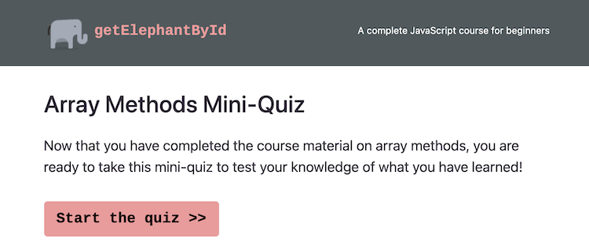
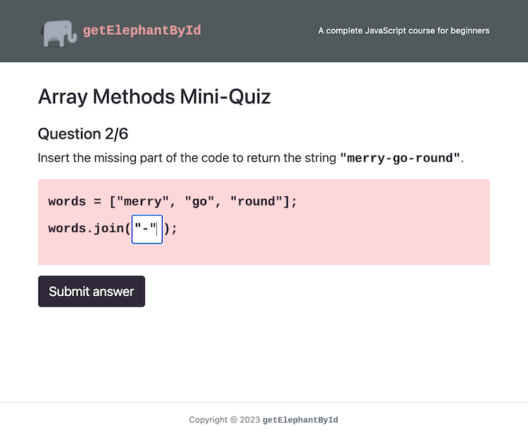
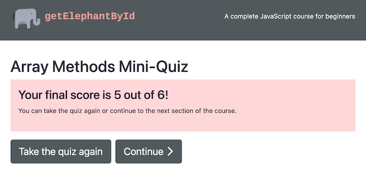

   

This is a project completed as part of the Code First Girls Nano Degree in Software Engineering.

The project consists of a 6 question quiz on the topic of JavaScript Array Methods, and is conceived as being part of a larger online beginner's course in JavaScript.

The project is built using HTML, CSS with Bootstrap 4 and vanilla JavaScript.

# Play the quiz [here](https://jengori.github.io/getElephantById/).

## Screenshots

